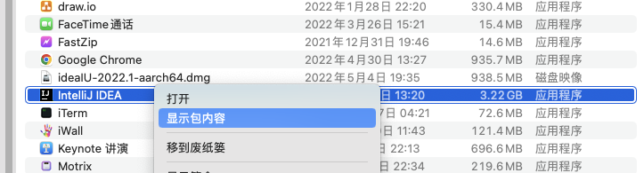
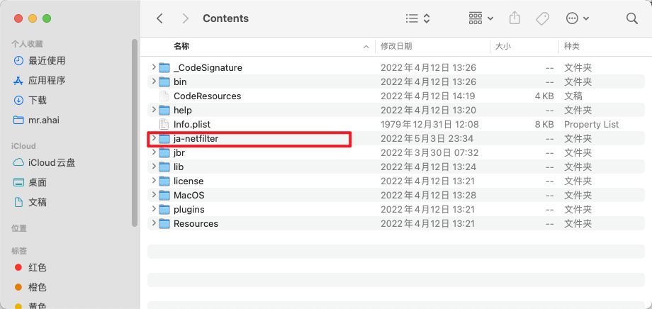
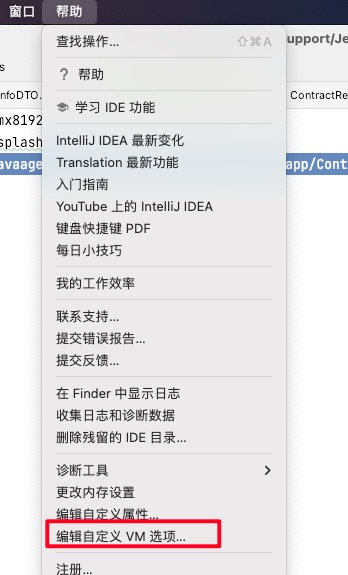

# idea2022-unlockTool
idea2022.1 破解过程（含破解插件）

这里以macos为例
首先打开idea的安装目录

之后将ja-netfilter.zip减压后放入该目录下，如图所示

之后打开idea点开

在下面输入

-javaagent:/Applications/IntelliJ IDEA.app/Contents/ja-netfilter/ja-netfilter.jar

之后重新启动idea，打开注册，选择激活
输入 http://adsk06.tpu.ru:8080